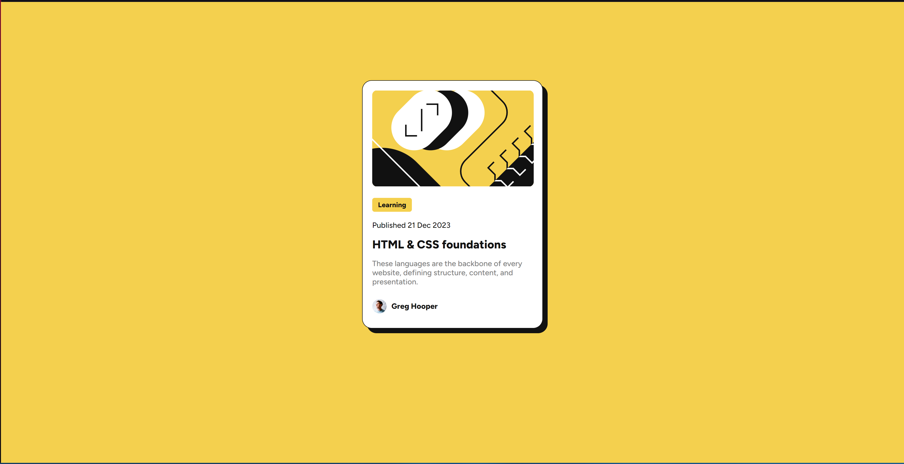

# Frontend Mentor - Blog preview card solution

This is a solution to the [Blog preview card challenge on Frontend Mentor](https://www.frontendmentor.io/challenges/blog-preview-card-ckPaj01IcS).

## Table of contents

- [Overview](#overview)
  - [The challenge](#the-challenge)
  - [Screenshot](#screenshot)
  - [Links](#links)
- [My process](#my-process)
  - [Built with](#built-with)
  - [Continued development](#continued-development)
  - [Useful resources](#useful-resources)
- [Author](#author)

## Overview

### The challenge

Users should be able to:

- See hover and focus states for all interactive elements on the page

### Screenshot

### Links

- Live Site URL: [Blog Preview Card](nemesis-12.github.io/blog-preview-card/)

## My process

### Built with

- HTML5
- CSS
- Flexbox

### Continued development

I will be attempting the solution again by using various frameworks/libraries such as React, Bootstrap, Tailwind, and so on.

### Useful resources

- [CSS-Tricks Flexbox Guide](https://css-tricks.com/snippets/css/a-guide-to-flexbox/) - If you ever need help with understanding CSS Flexbox this is the best resource to go to.

## Author

- Website - [Farhan Mohammed (Still under construction)](https://famohammed.vercel.app)
- Frontend Mentor - [@Nemesis-12](https://www.frontendmentor.io/profile/Nemesis-12)
